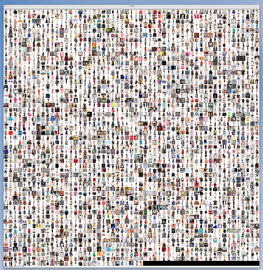
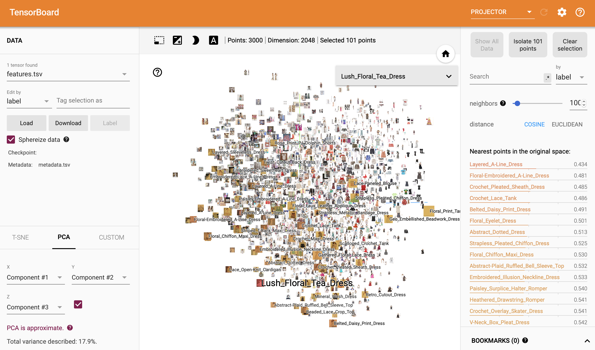
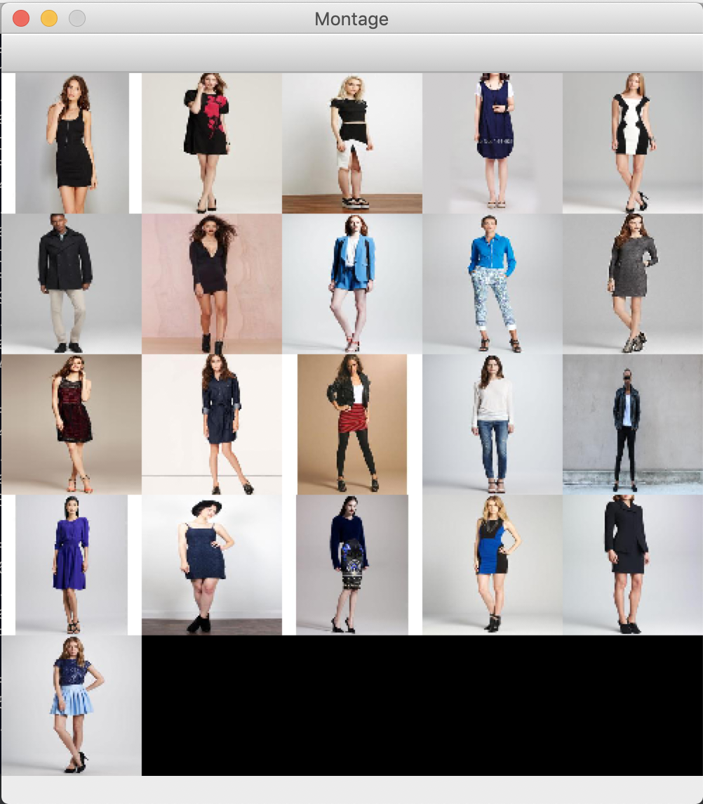
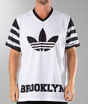
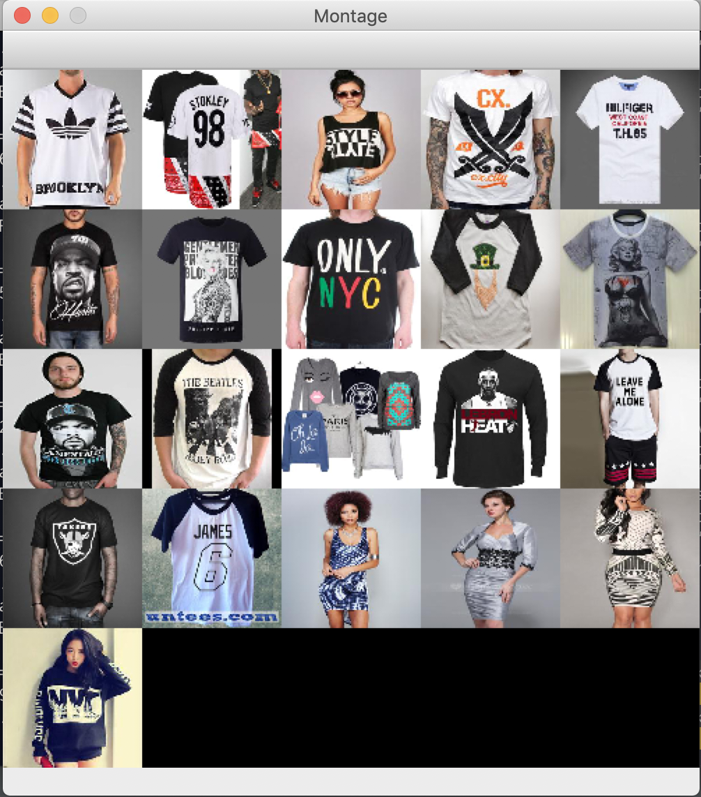
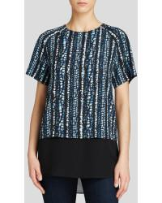
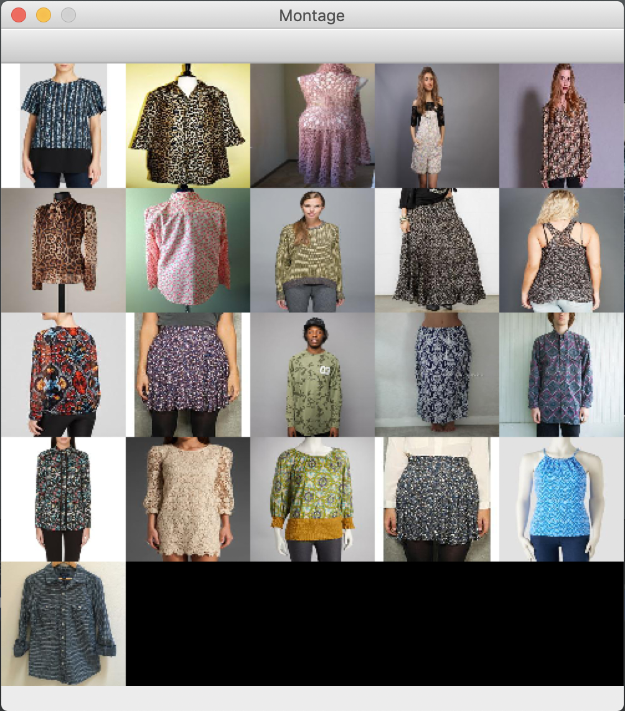

# SimImg (Similar Image)

SimImg is a set of tools used to find similar images. In this repo I am providing example using DeepFashion dataset. If you have image with some kind of outfit in it, you can search for similar ones by visual similarity.

## Pipeline
* Every image in image dataset is converted to multidimensional feature vector (`pre-trained InceptionResNetV2`)
* Source image is converted to same feature vector
* Similarity between source image and every dataset images is calculated (`cosine similarity`)
* Most similar images are selected as result

## Files description
* `config.py` - main config file of a system
* `download_dataset.py` - downloads DeepFashion dataset into local hard drive (`data/deepfashion/`)
* `generate_features_db.py` - generates feature vectors for every image in a dataset (`data/features_db.pckl`)
* `search.py` - loads generated features DB and makes search for similar images in DB
* `image_2_vector.py` - converts image to its feature vector
* `generate_td_projector_data.py` - generates tensorboard projector files two view feature vectors in thier embeddings space (`data/projector/`) 
 
## Image embeddings
Output of pre-trained model: `InceptionResNetV2(weights='imagenet', include_top=False, pooling='avg')`

## TensorBoard projector
It is very resource intensive task. Be careful when selecting number of images to add to projector, cause in order to use TB projector all images are merged into singe montage image. 



```
python generate_tb_projector_data.py --path data/montage --output data/projector --dataset_num 3000

cd data/projector

tensorboard --logdir .
```



## Google Colab
To speed up features DB generation Google Colab with it's free GPU was used. Notebook is located in colab_notebooks folder. After features DB is created copy it to `data/` folder. 

## Search for similar images (interactive)
```
python search.py --num 20
```

Search result is similar images merged into single montage image, keeping source image the first one.
### Sample 1




### Sample 2




### Sample 3




## Dataset
https://drive.google.com/open?id=0B7EVK8r0v71pQ2FuZ0k0QnhBQnc

http://mmlab.ie.cuhk.edu.hk/projects/DeepFashion.html  